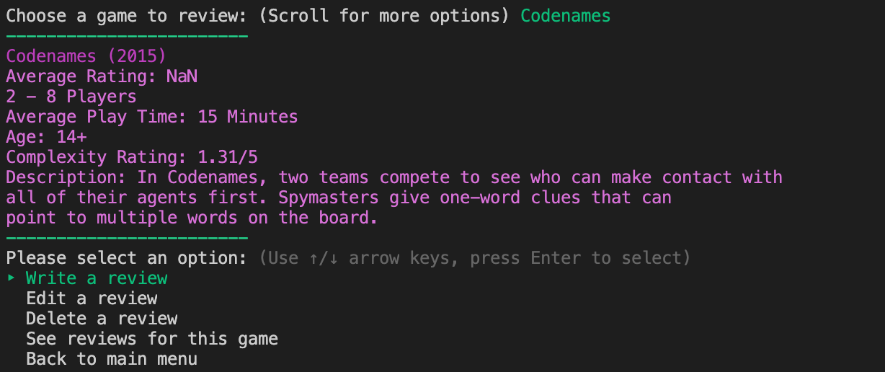

Flatiron - Mod 1 Project: My Board Games Reviewer
========================

My Board Games Reviewer was created by Christina ([christinamcmahon](https://github.com/christinamcmahon)). 

[Video walkthrough](https://youtu.be/Kngrksyw2u0)

## About

My Board Games Reviewer allows users to get information about and rate Christina's selection of board games. The user can also find information like which of Christina's board games is most popular.

This CLI app uses a database to persist information about Christina's board games. This project demonstrates the following skills:
- Ruby
- Object Orientation
- Relationships (via ActiveRecord)
- Problem Solving (via creating a Command Line Interface (CLI))

This app makes use of the following gems:
- [tty-font](https://github.com/piotrmurach/tty-font)
- [tty-prompt](https://github.com/piotrmurach/tty-prompt)
- [colorize](https://github.com/fazibear/colorize)
- sinatra-activerecord
- sqlite3
- pry

## How to Use
 
1. Clone this to your computer
2. In the terminal, run **bundle**, **rake db:migrate** and **rake db:seed** to populate the database
3. Start the app by entering **ruby bin/run.rb** in the terminal 

## MVP

At a minimum, I wanted to the app to fulfill the following MVPs:
1. User should be able to see relevant information about a board game
2. User should be able to write a review for a board game
3. User should be able to edit one of their reviews for a board game
4. User should be able to delete one of their reviews for a board game
5. User should be able to see a list of all of their reviews

### Stretch Goals

In order to further my app, I wanted to:
1. Ensure the CLI is easy for the user to read
2. Use additional gems to make the app aesthetically pleasing
3. Use additional gems to make the app easy to navigate
4. Allow the user to see the most popular board game
5. Allow the user to see the average rating for a board game
6. Allow the user to see all reviews of a certain game

# Walkthrough

## Welcome Page

User's name defaults to 'User' if no name is entered.

## Main Menu

## Game Information

## Write Review

## See All Current User's Reviews

## See All Reviews of a Board Game

## Edit One of the Current User's Reviews

## Delete One of the Current User's Reviews

## Exit 

